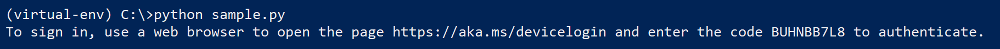
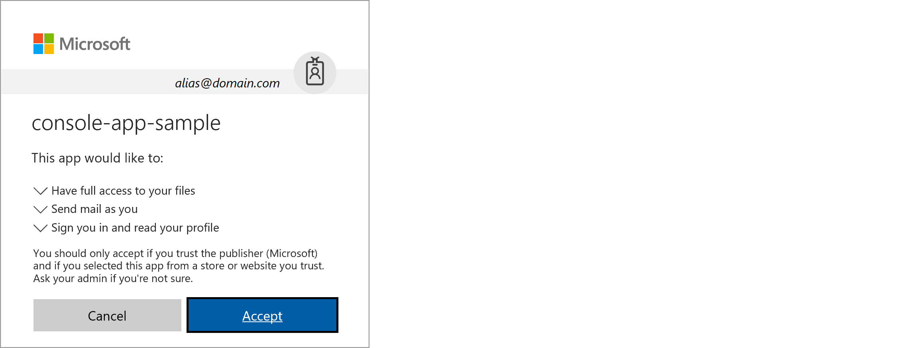
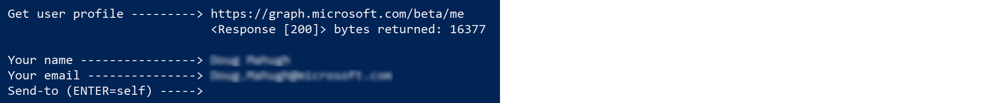
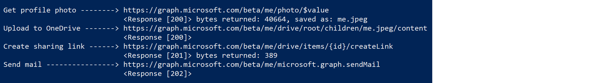
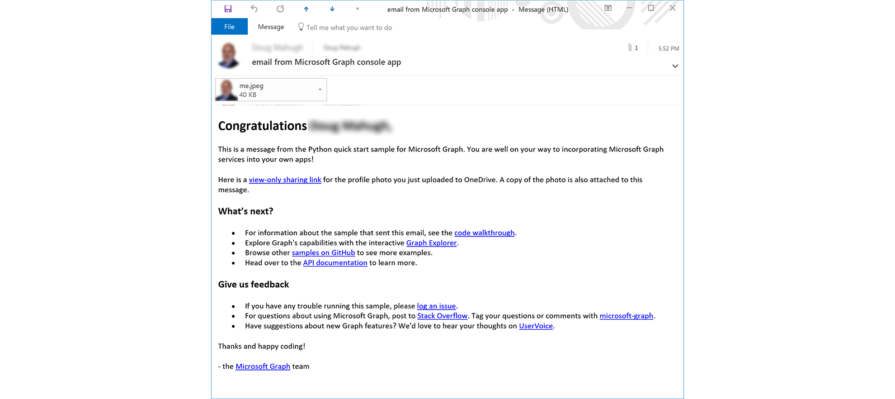
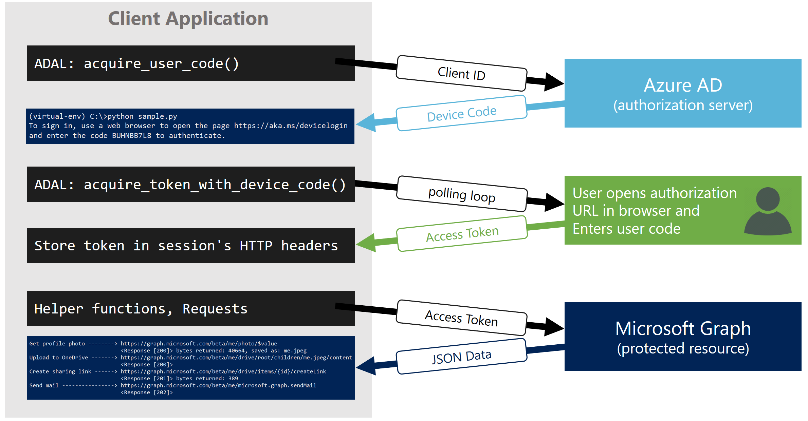

# Python console application for Microsoft Graph

  

This sample uses Microsoft Graph to read your user profile, download your profile photo, upload the photo to OneDrive, create a sharing link, and send an email on your behalf (to yourself by default).

Authentication is handled via [device flow authentication](#device-flow-authentication), the recommended approach for console applications. If you're looking for examples of how to work with Microsoft Graph from Python _web applications_, see [Python authentication samples for Microsoft Graph](https://github.com/microsoftgraph/python-sample-auth). For a web app sample that does the same things as this console app sample, see [Sending mail via Microsoft Graph from Python](https://github.com/microsoftgraph/python-sample-send-mail).

* [Installation](#installation)
* [Running the sample](#running-the-sample)
* [Device Flow authentication](#device-flow-authentication)
* [Helper functions](#helper-functions)
* [Contributing](#contributing)
* [Resources](#resources)

## Installation

Verify that you have the following prerequisites in place before installing the sample:

* Install Python from [https://www.python.org/](https://www.python.org/). You'll need Python 3.6 or later, primarily because of the use of [f-strings](https://www.python.org/dev/peps/pep-0498/) &mdash change those to [format strings](https://docs.python.org/3/library/stdtypes.html#str.format) if you need to use an earlier Python 3.x version. If your code base is running under Python 2.7, you may find it helpful to use the [3to2](https://pypi.python.org/pypi/3to2) tools to port the code to Python 2.7.
* The sample can be run on any operating system that supports Python 3.x, including recent versions of Windows, Linux, and Mac OS. In some cases, you may need to use a different command to launch Python &mdash; for example, some Linux distros reserve the command ```python``` for Python 2.7, so you need to use ```python3``` to launch an installed Python 3.x version.
* This sample requires an [Office 365 for business account](https://msdn.microsoft.com/en-us/office/office365/howto/setup-development-environment#bk_Office365Account).
* To register your application in the Azure Portal, you will need an Azure account associated with your Office 365 account. No charges will be incurred for registering your application in the Azure Portal, but you must have an account. If you don't have one, you can sign up for an [Azure Free Account](https://azure.microsoft.com/en-us/free/free-account-faq/).

Follow these steps to install the sample code on your computer:

1. Clone the repo with this command:
    * ```git clone https://github.com/microsoftgraph/python-sample-console-app.git```

2. Create and activate a virtual environment (optional). If you're new to Python virtual environments, [Miniconda](https://conda.io/miniconda.html) is a great place to start.

3. In the root folder of your cloned repo, install the dependencies for the sample as listed in the ```requirements.txt``` file with this command: ```pip install -r requirements.txt```.

## Application Registration

To run the sample, you will need to register an application and add the registered application's ID to the configuration information in the [config.py](https://github.com/microsoftgraph/python-sample-console-app/blob/master/helpers.py) file. Follow these steps to register and configure your application:

1. Navigate to the [Azure portal > App registrations](https://go.microsoft.com/fwlink/?linkid=2083908) to register your app. Sign in using a work or school account, or a personal Microsoft account.

2. Select **New registration**.

3. When the **Register an application page** appears, set the values as follows:
    1. Set **Name** to `PythonConsoleApp`.
    2. Set **Supported account types** to **Accounts in any organizational directory and personal Microsoft accounts**.
    3. Leave **Redirect URI** empty.
    4. Choose **Register**.

4. On the **PythonConsoleApp** overview page, copy and save the value for the **Application (client) ID**. You'll need it later.

5. Select **API permissions**.
   1. Choose the **Add a permission** button and then make sure that the **Microsoft APIs** tab is selected.
   2. In the **Commonly used Microsoft APIs** section, select **Microsoft Graph**, and then select **Delegated permissions**.
   3. Use the **Select permissions** search box to search for the `Files.ReadWrite` and `Mail.Send` permissions.
   4. Select the checkbox for each permission as it appears.
      > **NOTE:** Permissions will not remain visible in the list as you select each one.

6. Go to the **Authentication** page. 
    1. Check the box next to `https://login.microsoftonline.com/common/oauth2/nativeclient`.
    2. Find the setting labeled **Default client type** and set it to `Yes`.
    3. Select **Save** at the top of the page.

After registering your application, modify the ```config.py``` file in the root folder of your cloned repo, and follow the instructions to enter your Client ID (the Application ID value you copied in Step 3 earlier). Save the change, and you're ready to run the sample.

## Running the sample

Follow these steps to run the sample app:

1. At the command prompt, run the command ```python sample.py```. You'll see a message telling you to open a page in your browser and enter a code.


2. After entering the code at https://aka.ms/devicelogin, you'll be prompted to select an identity or enter an email address to identify yourself. The identity you use must be in the same organization/tenant where the application was registered. Sign in, and then you'll be asked to consent to the application's delegated permissions as shown below. Choose **Accept**.


3. After consenting to permissions, you'll see a message saying "You have signed in to the console-app-sample application on your device. You may now close this window." Close the browser and return to the console. You are now authenticated, and the app has a token that can be used for Microsoft Graph requests. The app will request your user profile and display your name and email address, then prompt you for a destination email address. You may enter one or more email recipients (delimited with ```;```), or press **Enter** to send the email to yourself.


4. After entering email recipients, you'll see console output showing the Graph endpoints and responses for the remaining steps in the sample app: getting your profile photo, uploading it to OneDrive, creating a sharing link, and sending the email.


Check your email, and you'll see the email that has been sent. It includes your profile photo as an attachment, as well as a view-only sharing link to the copy of your profile photo that was uploaded to the root folder of your OneDrive account.



## Device Flow authentication

Microsoft Graph uses Azure Active Directory (Azure AD) for authentication, and Azure AD supports a variety of [OAuth 2.0](http://www.rfc-editor.org/rfc/rfc6749.txt) authentication flows. The recommended authorization flow for Python console apps is [device flow](https://tools.ietf.org/html/draft-ietf-oauth-device-flow-07), and this sample uses [Microsoft ADAL for Python](https://github.com/AzureAD/azure-activedirectory-library-for-python) to implement device flow as shown in the diagram below.



The ```device_flow_session()``` function of [helpers.py](https://github.com/microsoftgraph/python-sample-console-app/blob/master/helpers.py) handles the authentication details. As you can see in [sample.py](https://github.com/microsoftgraph/python-sample-console-app/blob/master/sample.py#L82-L84), we try to create a session and then if successfully created we use that session to send mail:

```python
GRAPH_SESSION = device_flow_session(config.CLIENT_ID)
if GRAPH_SESSION:
    sendmail_sample(GRAPH_SESSION)
```

The first step in ```device_flow_session()``` is to [call ADAL's acquire_user_code() method](https://github.com/microsoftgraph/python-sample-console-app/blob/master/helpers.py#L39-L40) to get a _user code_. This code is [displayed on the console](https://github.com/microsoftgraph/python-sample-console-app/blob/master/helpers.py#L42-L50), and that code must be entered on the _authorization URL_ page before it expires. While waiting for this to happen, the app [calls ADAL's acquire_token_with_device_code() method](https://github.com/microsoftgraph/python-sample-console-app/blob/master/helpers.py#L52-L54), which begins polling to check whether the code has been entered. When the code is entered and the user consents to the requested permissions, an access token is returned. The app then [creates a Requests session and stores the access token in the session's Authorization header](https://github.com/microsoftgraph/python-sample-console-app/blob/master/helpers.py#L58-L61), where it will be sent with calls to Microsoft Graph via the session's HTTP verb methods such as ```get()``` or ```post()```.

This sample doesn't use a **refresh token**, but it's easy to obtain a refresh token if you'd like to provide your users with a "remember me" experience that doesn't require logging in every time they run your app. To get a refresh token, register the application with ```offline_access``` permission, and then you'll receive a refresh token which you can use with ADAL's [acquire_token_with_refresh_token](https://github.com/AzureAD/azure-activedirectory-library-for-python/blob/dev/sample/refresh_token_sample.py#L47-L69) method to refresh a Graph access token.

## Helper functions

Several helper functions in [helpers.py](https://github.com/microsoftgraph/python-sample-console-app/blob/master/helpers.py) provide simple wrappers for common Graph operations, and provide examples of how to make authenticated Graph requests via the methods of the session object. These helper functions can be used with any auth library &mdash; the only requirement is that the session object has a valid Graph access token stored in its ```Authorization``` header.

### A note on HTTP headers

In this sample, the session object sends the required ```Authorization``` header (which contains the access token) as well as optional headers to identify the libraries used. These headers are set [during the authentication process](https://github.com/microsoftgraph/python-sample-console-app/blob/master/helpers.py#L59-L61). In addition, you may want to create other headers for certain Graph calls. You can do this by passing a ```headers``` dictionary to the Graph call, and this dictionary will be merged with the default headers on the session object. You can see an example of this technique in  parameter for any of the ```send_mail``` helper function, which adds a ```Content-Type``` header as shown [here](https://github.com/microsoftgraph/python-sample-console-app/blob/master/helpers.py#L138-L138).

### api_endpoint(url)

Converts a relative path such as ```/me/photo/$value``` to a full URI based on the current RESOURCE and API_VERSION settings in config.py.

### device_flow_session(client_id, auto=False)

Obtains an access token from Azure AD (via device flow) and create a Requests session instance ready to make authenticated calls to Microsoft Graph. The only required argument is the **client_id** of the [registered application](#application-registration).

The optional **auto** argument can be set to ```True``` to automatically launch the authorization URL in your default browser and copy the user code to the clipboard. This can save time during repetitive dev/test activities.

### profile_photo(session, *, user_id='me', save_as=None)

Gets a profile photo, and optionally saves a local copy. Returns a tuple of the raw photo data, HTTP status code, content type, and saved filename.

### send_mail(session, *, subject, recipients, body='', content_type='HTML', attachments=None)

Sends email from current user. Returns the Requests response object for the POST.

### sharing_link(session, *, item_id, link_type='view')

Creates a sharing link for an item in OneDrive.

### upload_file(session, *, filename, folder=None)

Uploads a file to OneDrive for Business.

## Contributing

These samples are open source, released under the [MIT License](https://github.com/microsoftgraph/python-sample-console-app/blob/master/LICENSE). Issues (including feature requests and/or questions about this sample) and [pull requests](https://github.com/microsoftgraph/python-sample-console-app/pulls) are welcome. If there's another Python sample you'd like to see for Microsoft Graph, we're interested in that feedback as well &mdash; please log an [issue](https://github.com/microsoftgraph/python-sample-console-app/issues) and let us know!

This project has adopted the [Microsoft Open Source Code of Conduct](https://opensource.microsoft.com/codeofconduct/). For more information, see the [Code of Conduct FAQ](https://opensource.microsoft.com/codeofconduct/faq/) or contact [opencode@microsoft.com](mailto:opencode@microsoft.com) with any additional questions or comments.

## Resources

* Authentication:
    * [Microsoft ADAL for Python](https://github.com/AzureAD/azure-activedirectory-library-for-python)
    * [Python authentication samples for Microsoft Graph](https://github.com/microsoftgraph/python-sample-auth)
    * [OAuth 2.0 Device Flow for Browserless and Input Constrained Devices](https://tools.ietf.org/html/draft-ietf-oauth-device-flow-07)
* Graph API documentation:
    * [Get a user](https://developer.microsoft.com/en-us/graph/docs/api-reference/v1.0/api/user_get)
    * [Get photo](https://developer.microsoft.com/en-us/graph/docs/api-reference/v1.0/api/profilephoto_get)
    * [Upload or replace the contents of a DriveItem](https://developer.microsoft.com/en-us/graph/docs/api-reference/v1.0/api/driveitem_put_content)
    * [Create a sharing link for a DriveItem](https://developer.microsoft.com/en-us/graph/docs/api-reference/v1.0/api/driveitem_createlink)
    * [Send mail](https://developer.microsoft.com/en-us/graph/docs/api-reference/v1.0/api/user_sendmail)
* Other Python samples for Microsoft Graph:
    * [Sending mail via Microsoft Graph from Python](https://github.com/microsoftgraph/python-sample-send-mail) (web app)
    * [Working with paginated Microsoft Graph responses in Python](https://github.com/microsoftgraph/python-sample-pagination)
    * [Working with Graph open extensions in Python](https://github.com/microsoftgraph/python-sample-open-extensions)
